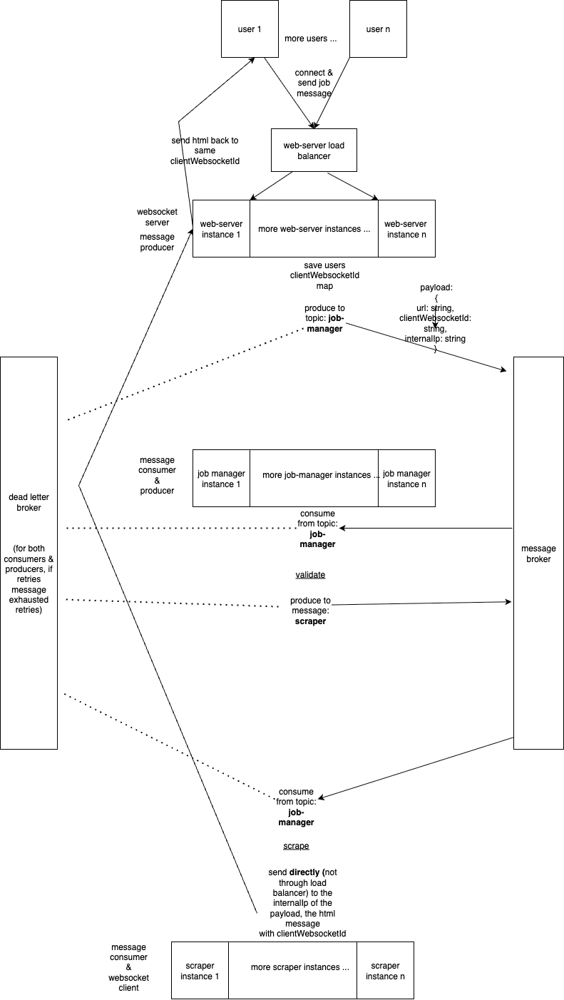

## Prerequisites
1. K8s cluster(i'm using kind, perhaps could be minikube etc..)
2. kubectl
3. docker-compose for building the apps images for k8s (can also be used for local debugging - both the kafka broker, also option for docker containers of the apps))
4. nodejs (i'm using v20) & nestjs for local debugging

## Deployment

### K8s:
#### Install kafka (note there's also a kafka-ui deployment & service for your cenvenience):
  ```
  kubectl create namespace kafka

  # from https://strimzi.io/quickstarts/
  kubectl create -f k8s/kafka-deployment.yaml -n kafka # from https://strimzi.io/install/latest?namespace=kafka
  kubectl apply -f k8s/kafka-single-node.yaml -n kafka # from https://strimzi.io/examples/latest/kafka/kafka-single-node.yaml
  ```

#### Deploy services:
  build the image  
  load to local k8s registry
  for services that have open ports (web-server) - expose the service itself
  apply the kubectl yaml file  
  scale if you want
  see logs

  for example this deploys the scraper service:
  ```
    SERVICE=scraper

    # build and load
    docker compose build $SERVICE --progress=plain --no-cache
    kind load docker-image scraper-${SERVICE}:latest

    # only for services that have open ports (web-server/scraper) 
    kubectl apply -f k8s/$SERVICE-service.yaml 

    # deployment of services
    kubectl delete -f k8s/$SERVICE-deployment.yaml 
    kubectl apply -f k8s/$SERVICE-deployment.yaml 

    # scale
    kubectl patch deployment $SERVICE -n kafka -p '{"spec":{"replicas":2}}'

    # see logs
    kubectl logs $(kubectl get pods -n kafka | grep $SERVICE | awk '{print $1;}') -n kafka -f              
  ``` 

#### Port forward (for debugging from local machine)
  ```
  kubectl port-forward -n kafka deployment/web-server 3001:3001 & kubectl port-forward -n kafka deployment/kafka-ui 8080:8080
  ```

### Local debugging:
#### Install kafka using docker-compose
```
  docker-compose up kafka -d
  docker-compose up kafka-ui -d
```

#### docker compose apps locally
run the app you want as docker container, for example:
````
  docker-compose up scraper -d
````

#### Debug locally:
enter the relevant directory for the app you want to debug
install dependencies  
compile  
run the app
```
cd apps/scraper
npm i
npm run build
npm run start:dev
```

## Sanity E-2-E test:

```
# from k8s cluster pod that has node installed"
const WebSocket = require('ws');

# from browser no need to do anything, but is server is using k8s - goes to same pod every time

# run test code
const ws = new WebSocket('ws://localhost:3001');

ws.onopen = () => {
  console.log('Connected to proxy server.');
};

ws.onmessage = (event) => {
  console.log('Message from server:', event.data);
};

ws.onclose = () => {
  console.log('Disconnected from proxy server.');
};

ws.send(JSON.stringify({event: 'job', message: 'https://google.com'}));

```


## TODOS:  

### General TODOS:  
1. implement proxy
2. implement autoscaling with keda/other


### Unhandled edge cases: 
1. If in the window between the time the job is created in the web-server, and the time the scraper finished processing it and sent the response back to the web-server, the web-server instance is terminated and it's ip is replaced - then the response will never be sent to the client. Yet, the html response is persisted to the message broker in the dead letter queue.

2. During that same window, the user's connection is closed, and the message is not delivered. In this case, given the time i had, i only logged the html response and the error message to the console.error (ideally would have been persisted to some error DB or external tool).

Both of the above edge cases would have been easier to mitigate if i had persisted the html to some other topic, and that consumer would have sent the response back to the web-server websocket, but my original idea was not to load on the message broker with heavy html. Possibly this whole feature can also be accomplished with a regular http server instead of websockets, and persist the html to a DB with a transactional outbox pattern, and the user would have polled that, but, the text in the task was "recieves scrape jobs and returns html", so hard to tell if it's meant to be in same request, or can be in separate requests by polling.

3. Another edge case is that the consumer disconnects right before the message is being sent to the dead letter queue, causing never ending processing of the same message. Specifically, inside the k8s cluster, in case of edge case (1), the onerror/onclose events of the websocket client aren't reached, in this case the promise rejects after some timeout, but seems that the message is being consumed repeatedly. I didn't have the time to fix this issue. 

### Code improvements:
  1. ConcreteMessageProducerService is a real class but has an unused field outputTopic, but can't be abstract because it needs to   be used as a real instance by the producer using it - maybe can implement it by some smarter inheritence (though the consumer-producer already extends the consumer)  
  2. Web-server app.service binding of handleMessage - maybe there are prettier ways to accomplish that  
  3. scraper throwing a complex error if sending message to the web-server didn't work, and the consumer catches it - a bit ugly code
  4. more dynamic queue message types (currenly only one type and not dynamic to other types), as well as Url interface isn't used for as a type check  
4. add documentation regarding limitations and development flow


## Architecture diagram:



